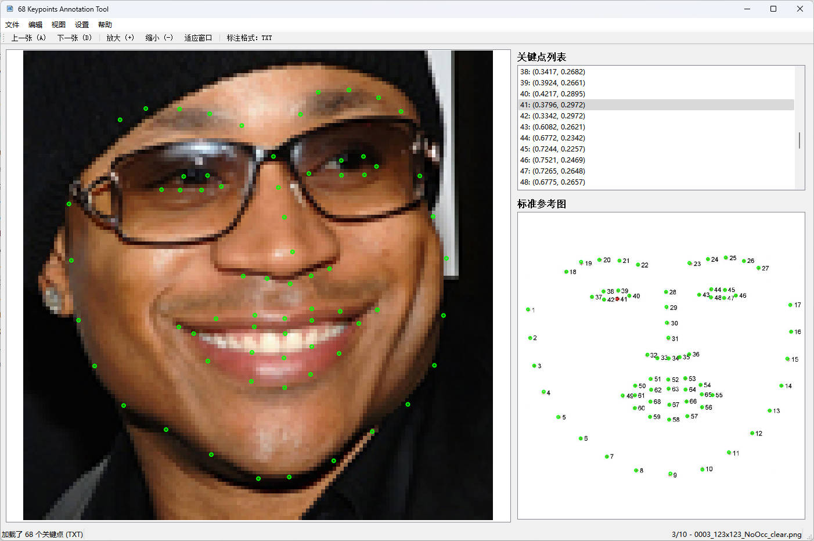

# 68关键点标注工具 - 使用说明

## 功能介绍

这是一个基于PyQt5开发的人脸68个关键点标注工具，支持：
- 图片浏览和标注
- 关键点的添加、删除、移动
- 标注结果自动保存为txt格式，可切换为json格式
- 图片缩放和拖动
- 撤销/重做功能
- 标准参考图对比


## 软件界面预览图




## 安装依赖

```bash
pip install PyQt5
```

## 运行方法

```bash
python keypoint_annotation_tool.py
```

## 快速体验

项目提供了demo图片供快速体验：

```bash
# 1. 转换demo标注（把txt转成json格式）
python convert_txt_to_json.py demo_jpg

# 2. 启动工具
python keypoint_annotation_tool.py

# 3. 打开demo_jpg目录，查看已标注的图片
```

## 使用方法

### 1. 打开图片目录
- 菜单栏：文件 → 打开目录
- 选择包含图片的文件夹
- 工具会自动加载所有支持的图片（jpg, jpeg, png, bmp）

### 2. 标注关键点

#### 添加关键点
1. 在右侧关键点列表中，点击"未标注"的点（红色显示）
2. 鼠标变成十字光标
3. 在图片上点击对应位置添加关键点

#### 移动关键点
1. 左键点击已标注的关键点选中
2. 按住左键拖动到新位置

#### 删除关键点
1. 在右侧列表或图片上选中关键点
2. 按 Delete 或 Backspace 键删除
3. 或使用菜单：编辑 → 删除选中点

#### 重新编号
1. 在右侧列表中拖动关键点
2. 拖到目标位置后会弹出确认对话框
3. 确认后交换两个点的编号

### 3. 图片导航

- **下一张**：按 D 键 或 点击工具栏"下一张"
- **上一张**：按 A 键 或 点击工具栏"上一张"
- 切换图片时会自动保存当前标注（如果开启了自动保存）

### 4. 图片缩放和移动

#### 缩放
- 鼠标滚轮：向上滚动放大，向下滚动缩小
- 工具栏：点击"放大"或"缩小"按钮
- 适应窗口：Ctrl+F 或 工具栏"适应窗口"

#### 移动
- 右键拖动：按住右键拖动图片

### 5. 显示设置

#### 切换显示样式
- 菜单：视图 → 圆点显示 / 十字显示

#### 显示/隐藏编号
- 菜单：视图 → 显示编号

### 6. 保存设置

#### 自动保存
- 菜单：设置 → 自动保存（默认开启）
- 开启后，每次操作会自动保存

#### 手动保存
- 快捷键：Ctrl+S
- 菜单：文件 → 保存

### 7. 撤销和重做

- **撤销**：Ctrl+Z（最多撤销10步）
- **重做**：Ctrl+Y
- **清空标注**：Ctrl+R（清空当前图片所有标注）

### 8. 标准参考图

#### 加载标准图
- 菜单：文件 → 选择标准图
- 默认会加载 `std_pic/facial_landmarks_68markup.jpg`

#### 参考图功能
- 标准参考图显示在右下角
- 点击关键点列表时，主图和参考图会同步高亮对应的点
- 方便对比标注位置是否正确

## 快捷键总结

| 快捷键 | 功能 |
|--------|------|
| Ctrl+O | 打开目录 |
| Ctrl+S | 保存标注 |
| Ctrl+Q | 退出程序 |
| Ctrl+Z | 撤销 |
| Ctrl+Y | 重做 |
| Ctrl+R | 清空标注 |
| Ctrl+F | 适应窗口 |
| A | 上一张图片 |
| D | 下一张图片 |
| Delete/Backspace | 删除选中的关键点 |

## 数据格式

### JSON文件格式
每张图片对应一个同名的JSON文件，**坐标使用比例系数（0-1之间）而非像素值**，格式如下：

```json
{
  "image_name": "example.jpg",
  "keypoints": [
    {"id": 1, "x": 0.3088, "y": 0.6803},
    {"id": 2, "x": 0.3253, "y": 0.6648},
    {"id": 3, "x": 0.3422, "y": 0.6493},
    
  ]
}
```

**注意**：
- `x` 和 `y` 是相对于图片宽度和高度的比例系数（0.0 到 1.0）
- 例如：x=0.5 表示水平方向上图片宽度的50%位置
- 使用比例坐标的好处：不受图片尺寸影响，标注可以适配不同分辨率的图片

### 文件组织
```
your_image_folder/
├── image1.jpg
├── image1.txt/json
├── image2.png
├── image2.txt/json
└── ...
```

## 标准图说明

标准的68个关键点人脸标注图应放在 `std_pic/` 目录下：
- 图片文件：`facial_landmarks_68markup.jpg`
- 标注文件（可选）：`facial_landmarks_68markup.json`

如果没有标注文件，标准图只显示图片。如果有标注文件，会在标准图上显示关键点。

## 注意事项

1. **关键点编号**：1-68，不能超出范围
2. **删除点后编号不变**：删除第5个点后，编号仍保留为5，在列表中以红色"未标注"显示
3. **自动保存**：建议开启自动保存，避免数据丢失
4. **撤销限制**：最多撤销10步操作
5. **图片格式**：支持 jpg, jpeg, png, bmp 格式

## 界面布局

```
┌─────────────────────────────────────────────────────────────┐
│ 菜单栏：文件 | 编辑 | 视图 | 设置                              │
├─────────────────────────────────────────────────────────────┤
│ 工具栏：上一张 | 下一张 | 放大 | 缩小 | 适应窗口              │
├──────────────────────────────────┬──────────────────────────┤
│                                  │  关键点列表              │
│                                  │  1: (100.0, 200.0)       │
│        图片显示区域               │  2: 未标注               │
│     （支持缩放和拖动）             │  3: (150.0, 210.0)       │
│                                  │  ...                     │
│                                  ├──────────────────────────┤
│                                  │                          │
│                                  │   标准参考图             │
│                                  │                          │
└──────────────────────────────────┴──────────────────────────┘
│ 状态栏：当前状态 | 图片进度 (1/100 - image.jpg)              │
└─────────────────────────────────────────────────────────────┘
```

## 数据转换工具

### TXT转JSON转换器

如果你有txt格式的标注文件（格式：x1 y1 x2 y2 ... x68 y68），可以使用转换工具：

```bash
# 批量转换目录中的所有txt标注
python convert_txt_to_json.py <目录路径>

# 示例
python convert_txt_to_json.py ./demo_jpg
```

**功能**：
- 自动查找目录中的所有txt标注文件
- 解析68个关键点的坐标（空格分隔）
- 生成同名的JSON文件
- 自动匹配对应的图片文件
- 支持比例坐标格式（0-1之间）

**TXT格式要求**：
```
x1 y1 x2 y2 x3 y3 ... x68 y68
```
- 一行包含136个数值
- 坐标为比例系数（0.0 到 1.0）
- 空格分隔

**JSON文件格式**：
```json
{
  "image_name": "example.jpg",
  "keypoints": [
    {"id": 1, "x": 0.3088, "y": 0.6803},
    {"id": 2, "x": 0.3253, "y": 0.6648},
    {"id": 3, "x": 0.3422, "y": 0.6493},
    
  ]
}
```

## 常见问题

### Q: 如何快速标注？
A:
1. 开启自动保存
2. 使用快捷键 A/D 快速切换图片
3. 在列表中点击未标注的点，然后在图片上点击添加

### Q: 误操作了怎么办？
A: 使用 Ctrl+Z 撤销，最多可以撤销10步

### Q: 如何批量处理图片？
A: 打开包含所有图片的目录，使用 A/D 键快速切换图片进行标注

### Q: 标准参考图有什么用？
A:
- 显示标准的68个关键点位置
- 点击列表时，主图和参考图同步高亮
- 方便对比和参考标注位置

### Q: 可以修改关键点编号吗？
A: 可以，在列表中拖动关键点到目标位置，确认后会交换两个点的编号

## 开发信息

- 开发语言：Python 3
- GUI框架：PyQt5
- 支持的图片格式：jpg, jpeg, png, bmp
- 标注格式：JSON

## 更新日志

### v1.0.0 (2025-11-27)
- 初始版本发布
- 支持68个关键点标注
- 图片缩放、拖动、导航
- 自动保存和撤销/重做
- 标准参考图对比
- 关键点重新编号
